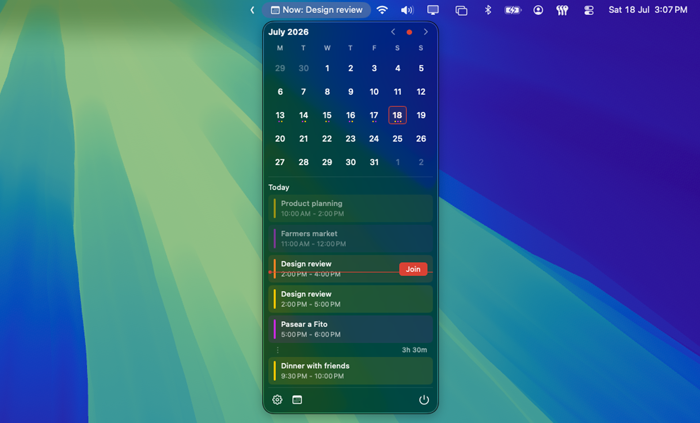

# Mou Sugu

**Your next meeting, always one glance away.**

*Mou Sugu (もうすぐ) is Japanese for "almost here".*

A tiny, native macOS menu bar app that shows a live countdown to your next event
and lets you jump into the call with a single click.

**[mousugu.app](https://mousugu.app)** · [Blog](https://mousugu.app/blog) · [Español](https://mousugu.app/es) · [日本語](https://mousugu.app/ja)

 

---

## Why

Your Mac already knows your schedule — your menu bar doesn't. Mou Sugu
puts the one thing you actually care about right where you're looking: **how long
until your next meeting, and the button to join it.** No window to open, no app to
switch to, no tab to hunt for.

The name is the product: *mou sugu* is what you say in Japanese when something is
almost here — the train pulling in, the show about to start. The red dot in the
icon is your next meeting, rising.

## Features

- **Live meeting countdown** — `in 12m: Standup`, `in 2h: 1:1`, or `Now: Design review`. The menu bar updates every minute and rolls over to the next event on its own.
- **One-click meeting join** — detects Zoom, Google Meet, Microsoft Teams, and Webex links in the event URL or notes and surfaces a **Join** button on your next call. The button sticks around for a 1h grace window after a meeting ends, and switches to **Rejoin** once you're more than 5 minutes into a call.
- **Today at a glance** — a clean popover lists the rest of today's events, color-coded to match each calendar.
- **Your calendars, your rules** — works with iCloud, Google Calendar, and Outlook. Toggle exactly which calendars feed the bar; events you're marked *free* for (focus blocks, tentative holds) are hidden by default.
- **Native and weightless** — SwiftUI `MenuBarExtra`, translucent Control-Center-style glass, SF Symbols, full light/dark support, English and Spanish localization, and opt-in start at login via `SMAppService`.
- **Private by design** — runs in the App Sandbox, reads your calendar locally, and talks to no server. No account, no analytics, no tracking.

## Requirements

- macOS 15 (Sequoia) or later
- Calendar access (granted on first launch)

## Install

Grab the latest `.dmg` from the [Releases](../../releases) page,
open it, and drag **Mou Sugu** to your Applications folder. This build keeps
itself up to date through [Sparkle](https://github.com/sparkle-project/Sparkle).

A Mac App Store build is also published — same app, minus the updater, since the
App Store ships updates itself.

## Usage

1. Launch the app — a calendar icon with your next event appears in the menu bar.
2. Click it to see the rest of today and to join your next call.
3. Open **Preferences…** to choose calendars, hide free time, and enable start-at-login.

## Contributing

Want to build from source, translate the app, or cut a release? See
[CONTRIBUTING.md](CONTRIBUTING.md). Bug reports and feature ideas are welcome in
[Issues](../../issues).

## License

MIT — see [LICENSE](LICENSE).
