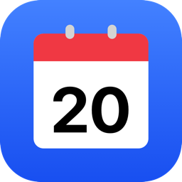

<div align="center">



# MenuBarCalendar

**Your next meeting, always one glance away.**

A tiny, native macOS menu bar app that shows a live countdown to your next event
and lets you jump into the call with a single click.

[](https://www.apple.com/macos/)
[](https://developer.apple.com/swift/)
[](#license)

</div>

---

## Why

System Settings already knows your schedule — your menu bar doesn't. MenuBarCalendar
puts the one thing you actually care about right where you're looking: **how long
until your next meeting, and the button to join it.** No window to open, no app to
switch to, no tab to hunt for.

## Features

- **Live countdown in the menu bar** — `in 12m: Standup`, `in 2h: 1:1`, or `Now: Design review`. Updates every minute and rolls over to the next event on its own.
- **One-click join** — detects Zoom, Google Meet, Microsoft Teams, and Webex links in the event URL or notes, and surfaces a **Join** button on the next upcoming meeting.
- **Smart join states** — keeps the button around for a 1h grace window after a meeting ends, and switches to **Rejoin** once you're more than 5 minutes into a call.
- **Today at a glance** — a clean popover lists the rest of today's events, color-coded to match each calendar.
- **Pick your calendars** — toggle exactly which calendars feed the bar.
- **Hide busywork** — events you're marked *free* for (focus blocks, tentative holds) are hidden by default.
- **Start at login** — opt in with one toggle, powered by `SMAppService`.
- **Native through and through** — SwiftUI `MenuBarExtra`, translucent Control-Center-style glass, SF Symbols, full light/dark support.
- **Localized** — English and Spanish, following your system language automatically.
- **Private by design** — runs in the App Sandbox, reads your calendar locally, and talks to no server.

## Screenshots

<div align="center">

<!-- Drop popover / menu-bar screenshots here -->
<em>A live countdown in the bar; today's events and a Join button in the popover.</em>

</div>

## Requirements

- macOS 15 (Sequoia) or later
- Calendar access (granted on first launch)

## Install

### Download

Grab the latest signed, notarized `.dmg` from the [Releases](../../releases) page,
open it, and drag **MenuBarCalendar** to your Applications folder.

### Build from source

```bash
git clone https://github.com/1930-dev/MenuBarCalendar.git
cd MenuBarCalendar
open MenuBarCalendar.xcodeproj
```

Then **Product → Run** in Xcode. On first launch, grant calendar access when prompted.

## Usage

1. Launch the app — a calendar icon with your next event appears in the menu bar.
2. Click it to see the rest of today and to join your next call.
3. Open **Preferences…** to choose calendars, hide free time, and enable start-at-login.

## Releasing

`scripts/release.sh` archives a Release build, signs it with your Developer ID,
notarizes it with Apple, staples the ticket, and packages a DMG. See the header
of the script for the one-time prerequisites (Developer ID certificate, notary
credentials, `create-dmg`). Auto-updates are wired through
[Sparkle](https://github.com/sparkle-project/Sparkle) — add `SUFeedURL` and
`SUPublicEDKey` to the target's Info.plist to start shipping appcast updates.

## Architecture

| File | Responsibility |
| --- | --- |
| [CalendarBarApp.swift](MenuBarCalendar/CalendarBarApp.swift) | App entry point, menu bar extra, popover UI, join-button logic |
| [CalendarStore.swift](MenuBarCalendar/CalendarStore.swift) | EventKit access, today's events, countdown, meeting-URL detection |
| [SettingsView.swift](MenuBarCalendar/SettingsView.swift) | Preferences window — General and Calendars panes |
| [UpdateChecker.swift](UpdateChecker.swift) | Optional Sparkle auto-update wrapper |
| [Constants.swift](MenuBarCalendar/Constants.swift) | Localized strings catalog |
| [DesignSystem.swift](DesignSystem.swift) | Spacing, radius, and layout tokens |

## Icon & legal

The app icon is an original design that follows the macOS visual language (Big Sur
and later) using geometry and shadows consistent with Apple's design guidelines. It
does **not** reproduce any copyrighted asset or trademark of Apple Inc. All glyphs
come from **SF Symbols**, licensed by Apple for use within its ecosystem.

Apple, macOS, and the Calendar icon are trademarks of Apple Inc., registered in the
U.S. and other countries.

## License

MIT — see [LICENSE](LICENSE).
